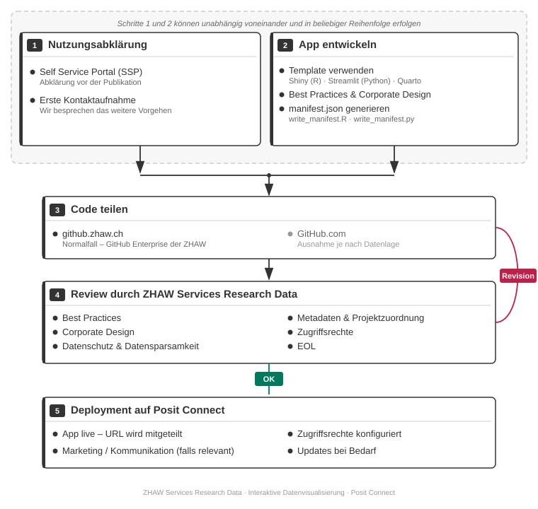

# Ablauf im Überblick

Diese Seite beschreibt den gesamten Prozess – vom Vorgespräch über die Entwicklung einer App bis zur Publikation auf Posit Connect.

## Prozessübersicht

Schritt 1 und 2 können unabhängig voneinander und in beliebiger Reihenfolge erfolgen.

## Detaillierte Beschreibung der Schritte

### Schritt 1: Vorgespräch

Den Anfang macht die erste Kontaktaufnahme: Gemeinsam besprechen wir das weitere Vorgehen. Danach füllst du im Self Service Portal (SSP) ein Formular aus, das bei Bedarf auch eine Nutzungsabklärung umfasst (Datenschutz, Ressourcen, Sicherheit). Details dazu auf der Seite [Nutzungsabklärung](nutzungsabklaerung.md).

### Schritt 2: App entwickeln

Du entwickelst deine App entweder mit unserem Template oder durch Einbinden einer bestehenden App. Unterstützt werden primär Shiny, Streamlit und Quarto; dazu gehören Best Practices, Corporate Design und das Generieren der `manifest.json`. Siehe [App entwickeln](app-entwickeln/template.md).

### Schritt 3: Code teilen

Der Source Code wird in einem Repository auf github.zhaw.ch bereitgestellt, damit Posit Connect die App direkt von dort lesen kann (GitHub.com nur als Ausnahme je nach Datenlage). Über Git ist auch die Kollaboration mit anderen Forschenden möglich. Siehe [Code teilen](code-teilen/github-zhaw.md).

### Schritt 4: Review

Wir prüfen Code und App – unter anderem auf Best Practices, Corporate Design, Datenschutz und Datensparsamkeit, Metadaten und Projektzuordnung, Zugriffsrechte sowie End of Life. Sind Anpassungen nötig, geht die App zur Überarbeitung zurück; andernfalls folgt das Deployment. Siehe [Deployment](deployment.md).

### Schritt 5: Deployment

Nach erfolgreichem Review übernehmen wir das Deployment auf Posit Connect. Die App geht live, die Zugriffsrechte werden konfiguriert und bei Bedarf folgen spätere Updates. Siehe [Deployment](deployment.md).
