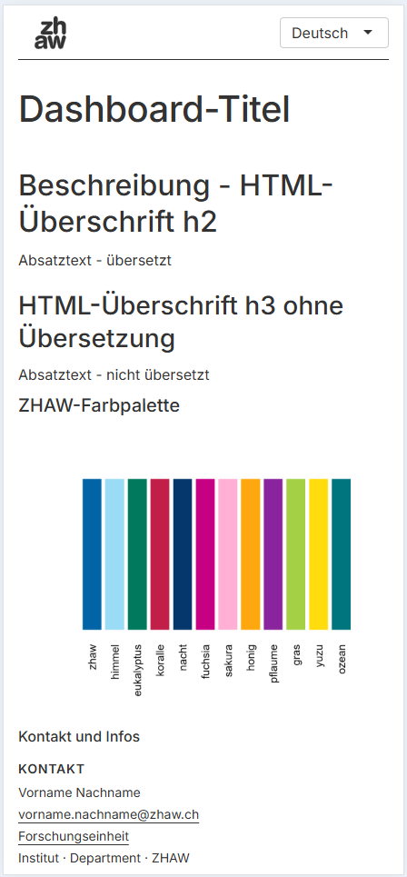
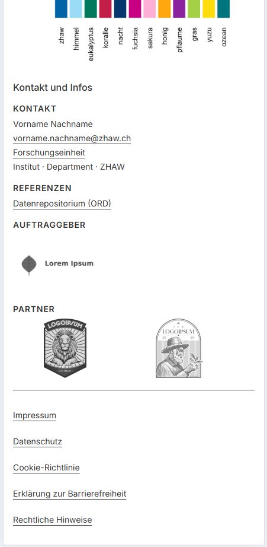

# Templates
## Why templates?

We provide templates for developing interactive data visualization applications. These templates include the basic application structure and serve as the recommended starting point for new applications.

Using the templates offers the following benefits:

- Consistent header and footer, including integration of the ZHAW logo in accordance with the corporate design guidelines
- Compliance with legal requirements, such as an imprint and privacy notice
- Responsive design (suitable display for desktop and mobile)
- Support for accessibility through structural guidelines and predefined color palettes aligned with the corporate design
- Built-in multilingual support
- Centralized configuration of application metadata through a configuration file

## Available Templates

- [shiny-base](https://github.zhaw.ch/service-research-data/shiny-base) – Template for Shiny (R)
- Template for Streamlit (Python) coming in Autumn 2026

!!! warning "Important Note"
    Please read the template's README carefully. It contains important information for effective and targeted use.

### Preview of the shiny-base Template

The shiny-base template can be run directly as an app without requiring any modifications or configuration. In smartphone view, the app looks as follows:

<!-- Die Bilder wurden mittels der Entwicklerfunktion in Chrome erzeugt (Auflösung iPhone 16 Pro Max) -->
<figure markdown>
 { width="300" }
<figcaption>First screen of the shiny-base template (Smartphone-view)</figcaption>
</figure>
  

<figure markdown>
 { width="300" }
<figcaption>Second screen of the shiny-base templatee (Smartphone-view)</figcaption>
</figure>