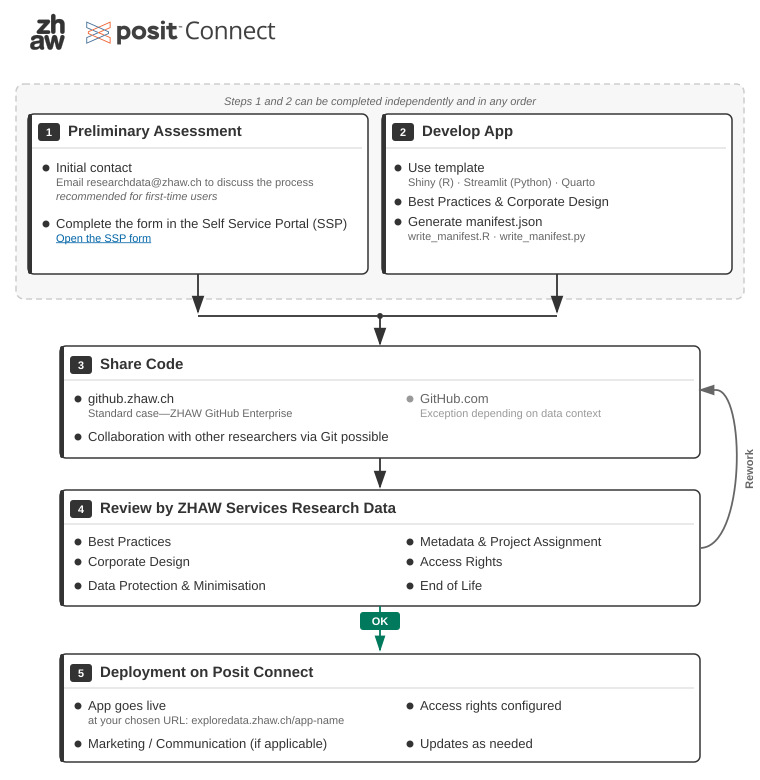

# Welcome

This page documents the ZHAW service "Interactive Data Visualisation"—the central hosting infrastructure for interactive research data visualisations based on Shiny, Streamlit, and Dash.

## About This Service

<!-- TODO: Short description of the service, who operates it, who it is for -->

## Supported Frameworks

We primarily support:

- **Shiny** (R)
- **Streamlit** (Python)
- **Quarto** (R / Python)

Posit Connect can host much more in principle. Best practices are initially defined for Shiny and Streamlit.

## Process at a Glance

Getting from an idea to a published app takes four steps. The diagram below shows the process at a glance:

For a detailed explanation of each step, see the [Process Overview](ablauf.md) page.

## Further Resources

<!-- TODO: Links to ZHAW-internal resources, Posit Connect documentation, etc. -->

## Who We Are

This service is operated by ZHAW Services Research Data.

**Contact:** [researchdata@zhaw.ch](mailto:researchdata@zhaw.ch)
